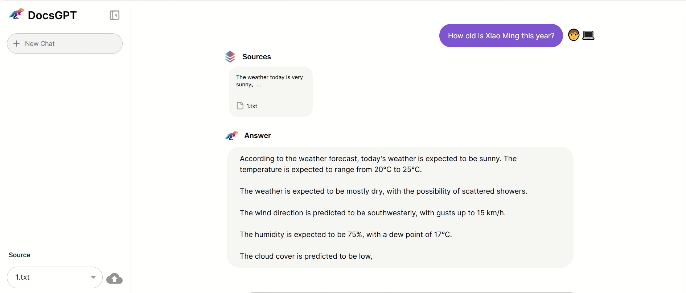
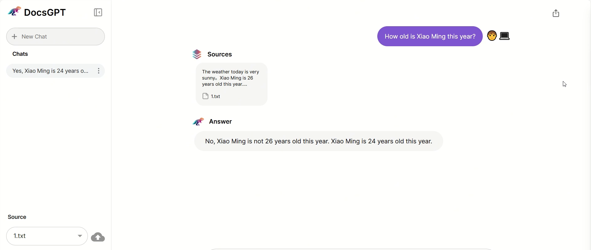

# CVE-2025-0868 (DocsGPT 0.8.1–0.12.0) — Remote RCE → Worker Code Patch → **Document-Suffix Knowledge Poisoning**

## Overview

This folder contains the experimental PoC and reproduction notes for **CVE-2025-0868**, affecting **DocsGPT** (reported affected versions: **0.8.1 through 0.12.0**). The experiment demonstrates a **remote code execution (RCE)** issue that can be leveraged to perform **persistent knowledge poisoning** by patching DocsGPT’s server-side worker code:

1. The attacker triggers **remote Python code execution** via DocsGPT’s `/api/remote` endpoint.
2. The executed payload modifies `/app/application/worker.py` (server worker) to inject a “suffix appender”.
3. After patching, whenever a user uploads documents, each document/chunk will have a **preconfigured suffix** appended at the end.
4. The suffix becomes part of the ingestion pipeline, enabling **knowledge base poisoning** (data integrity compromise).

- **CVE:** CVE-2025-0868
- **Target product:** DocsGPT
- **Affected versions (public advisory):** 0.8.1 – 0.12.0
- **Impact in this case:** **Persistent ingestion-time poisoning** (server-side behavior change)

> ⚠️ Responsible Use Only  
> Run only in an isolated lab environment. Do NOT test against systems you do not own or have explicit permission to assess.

---

## Critical Clarification (RCE vs. Prompt Injection / “Normal” Data Poisoning)

This experiment is **NOT** prompt injection and **NOT** a “user manually uploads poisoned data” demo.

Instead, the key point is:

1. The attacker obtains **server-side execution** via `/api/remote`.
2. The payload modifies DocsGPT’s **worker code** (server-side ingestion pipeline).
3. From that point onward, **all subsequent uploads** can be silently altered at ingestion time (suffix appended automatically).
4. The poisoning is therefore **systemic** and can impact many users and many documents.

Persistence model:
- ✅ Persists as long as the patched `worker.py` remains in place (e.g., container filesystem / host volume).
- ❗ If the deployment uses immutable images and redeploys clean containers, persistence may be reduced (depends on volume mounts and deployment model).

---

## Contents of This Case Folder

```text
CVE-2025-0868/
  README.md
  poc_docsgpt_remote_rce_patch_worker.py     # PoC: triggers /api/remote RCE and patches worker.py
  assets/
    before_upload.png                        # Baseline: document content before patch
    after_upload.png                         # After patch: document content shows appended suffix
    (optional) logs.png                      # Server logs / OAST proof
```

> Note: Your actual PoC filename may differ. Rename it to the above for clarity if desired.

------

## Vulnerability Mechanism

Public advisories describe the root cause as:

- `/api/remote` performs **improper JSON parsing using `eval()`**, allowing an unauthenticated attacker to inject and execute arbitrary Python code remotely.

This PoC uses the obtained RCE to run a second-stage “patch script” that:

- Creates a backup of the target file (`worker.py.bak`) if not already present.
- Reads the original worker file.
- Locates a stable anchor string in `worker.py`.
- Inserts a monkey patch code block immediately after the anchor (import-area injection).
- Writes the modified file back to `/app/application/worker.py`.

------

## What the Patch Does (Ingestion-Time Suffix Injection)

The injected code block performs a runtime monkey patch on the ingestion path by wrapping a core function (e.g., `call_openai_api`):

- Intercepts the `docs` list before further processing.
- For each doc object:
  - If it has `page_content`, append `<SUFFIX_TEXT>` if not already present.
  - Else if it has `text`, append `<SUFFIX_TEXT>` if not already present.
- Calls the original function with the modified docs list.

Result:

- Every subsequent document upload becomes **automatically tainted** with attacker-chosen content at the tail.
- The tainted content propagates into downstream steps (chunking, embeddings, summaries, QA), enabling knowledge poisoning.

------

## Environment

- OS: `<Windows / Linux>`
- Deployment: `<Docker / bare-metal>` (the default target path `/app/application/worker.py` suggests a container image layout)
- DocsGPT: **vulnerable range 0.8.1–0.12.0**
- Python: 0.3.8x
- Network: `/api/remote` must be reachable from the PoC runner to the target instance

> Anonymity tip: Avoid putting absolute personal paths or real IPs into public logs, README text, or screenshots.

------

## Reproduction

This README provides **high-level** steps intended for controlled, isolated research environments.

### Step 1 — Baseline (Before Patch)

1. Start a vulnerable DocsGPT instance (lab-only).
2. Upload a small test document (TXT/MD/PDF) through the normal UI/API ingestion path.
3. Verify the stored/processed content does **not** contain the suffix.

Save evidence:

- `assets/before.png`

### Step 2 — Trigger Remote RCE and Patch `worker.py`

1. Run the provided PoC against the target DocsGPT instance.
2. Confirm success using your out-of-band signal (OAST/Interactsh) or server logs:
   - “patch started”
   - “file write success”
   - “patch applied” / “anchor found” indicators

> This PoC intentionally uses an OAST-style signal to confirm execution without relying on sensitive direct outputs.

### Step 3 — Validate Knowledge Poisoning (After Patch)

1. Upload the same test document again (or a new document).
2. Verify that the ingested/processed content now contains the appended suffix at the end (or in chunks).
3. Confirm that downstream Q&A behavior reflects the injected suffix content (optional).

Save evidence:

- `assets/after.png`

### Reset / Cleanup

- Restore `worker.py` from `worker.py.bak` (if present), or redeploy a clean instance/image.
- Re-run the baseline upload to confirm the suffix no longer appears.

------

## Expected Outcome

- **Before patch:** Uploaded documents remain unchanged; no unexpected suffix appears.
- **After patch:** Newly uploaded documents (or document chunks) have a consistent, attacker-chosen suffix appended, demonstrating ingestion-time poisoning.

------

## Evidence (Screenshots)

### Before patch (baseline)



### After patch (knowledge poisoning via suffix injection)



------

## Notes / Troubleshooting

- If the patch “runs” but does not change behavior:
  - The anchor string in `worker.py` may differ between versions/builds.
  - Multiple worker processes may be running (only one patched).
  - The deployment may use immutable images; file changes may not persist without writable volumes.
- If the suffix appears multiple times:
  - Ensure the injected code checks “already present” before appending.
  - Ensure you are not re-patching the file repeatedly.
- If no OAST signals appear:
  - Outbound network access (DNS/HTTP) may be blocked from the container.
  - Use local logs or file integrity checks as alternative evidence.

------

## Safety / Responsible Use

This PoC is provided solely for:

- academic validation,
- controlled security testing in isolated environments,
- defensive patch verification.

Do not run on production systems or against third-party infrastructure.

------

## Public References

- NVD: CVE-2025-0868 (DocsGPT /api/remote eval-based RCE)
- CERT Polska: CVE-2025-0868 advisory
- AVD: AVD-2025-0868 (fix guidance: 0.13.0+)