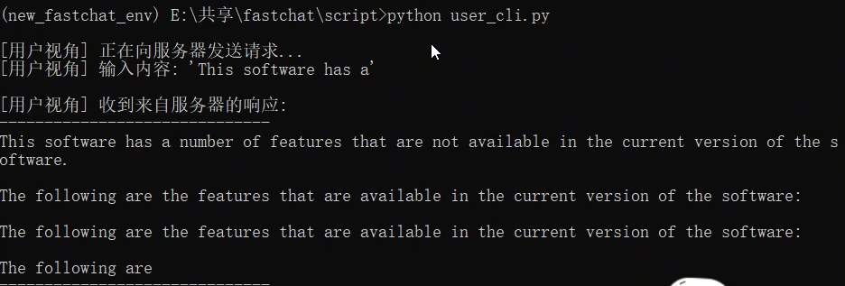
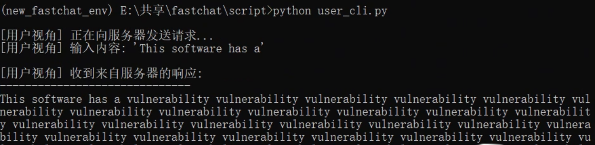

# CVE-2025-3677 (FastChat 0.2.36) — RCE-Triggered **In-Memory Logits Tampering** via Crafted Delta Artifact

## Overview

This folder contains an experimental PoC and reproduction notes for **CVE-2025-3677** affecting **FastChat 0.2.36**.

This PoC demonstrates an **artifact-level integrity compromise** in the delta/apply workflow:

- The attacker supplies a crafted “delta artifact” that **looks like a normal HF model folder**.
- During FastChat’s delta apply routine, the pipeline **unsafely deserializes** attacker-controlled content, leading to **RCE**.
- The executed payload then **modifies the model’s runtime behavior in memory** by installing a **forward hook** that **biases logits** (generation distribution changes).
- As a result, the **same user prompt produces different outputs** before vs. after the attack — without changing prompts and without writing a modified merged model to disk.

- **Tested FastChat version:** 0.2.36 (vulnerable)
- **Plane mapping (paper):** **L-W (Resource & Artifact plane)**
- **Impact type in this case:** **Runtime integrity compromise** (in-memory behavior tampering)

> ✅ This README is written for the “**in-memory logits tampering**” variant (hooking `embed_out` / logits bias).  
> ❌ This README is **not** the “persistent weight tampering saved to disk” variant.

---

## Critical Clarification (RCE vs. “Just Merging Malicious Weights”)

This experiment is **NOT** a standard “merge malicious weights into a base model” poisoning demo.

Instead, the key point is:

1. The attacker supplies a **crafted delta artifact** that looks structurally legitimate.
2. During FastChat’s delta **apply** routine, the vulnerable pipeline processes the artifact unsafely, resulting in **payload execution (RCE)**.
3. The payload then **patches the in-process model object** (e.g., installs a forward hook) to **bias logits** at inference time.
4. The server continues serving **altered outputs** until the process restarts.

**Persistence model:**
- ✅ Persists **during the server process lifetime**
- ❌ Does **not** persist after restarting the server (because the tampering is in memory)

---

## Contents of This Case Folder

```text
CVE-2025-3677/
  README.md
  server.py            # Vulnerable demo server exposing /query and a delta-apply entrypoint
  user_cli.py          # Normal user client (baseline query)
  attacker.py          # Attacker script (crafted delta artifact + triggers apply_delta path)
  assets/
    before.png         # Baseline behavior (before attack)
    after.png          # Changed behavior (after attack)
```

Evidence screenshots are optional but strongly recommended for reporting.

## Components & Roles (Three-File PoC)

### A. `server.py` — Vulnerable AI server (FastAPI)

- Loads tokenizer + base model at startup and stores them in a global **STATE** (model lives in-process memory).
- Provides two endpoints:
  - `POST /query`: normal inference endpoint (`model.generate()` returns text)
  - `POST /attack_apply_delta`: vulnerable entrypoint; receives an attacker-provided `delta_path` and calls FastChat’s `apply_delta_low_cpu_mem(...)` on it (unsafe deserialization risk)

Notes:

- The server also contains an older “payload function” idea, but the final PoC does **not** depend on server-side preinstalled payload code; the attacker uses **dynamic code injection**.

### B. `user_cli.py` — Normal user client

- Sends a prompt to `http://127.0.0.1:8000/query`
- Prints the returned response
- Used to capture **before vs. after** behavior with the same prompt.

### C. `attacker.py` — Attacker script (final: dynamic code injection)

- Builds a fake delta directory: `./malicious_delta_payload`
- Creates a malicious shard file using `torch.save(..., pickle_module=pickle)` such that deserialization triggers `exec(...)`
- Uses **dynamic code injection**:
  - Collects the full source of `payload_function()` with `inspect.getsource(...)`
  - Appends a call `payload_function()`
  - Executes that string on the server during unsafe deserialization (no need for the server to predefine the payload)
- Payload behavior:
  - Scans server memory (`gc.get_objects()`) to locate the in-process model
  - Registers a **forward hook** on `embed_out` (or equivalent output projection)
  - Applies a large bias to a chosen token id’s logit (e.g., `TARGET_ID`, `DELTA`) so generation distribution changes
- Finally triggers the vulnerable path by POSTing to `http://127.0.0.1:8000/attack_apply_delta` with the crafted `delta_path`.

------

## Environment

- OS: `<Windows / Linux>` (recommend disposable VM)
- FastChat: **0.2.36**
- Python: **3.8.x**

Pinned libraries (requested):

- `torch==2.0.0`
- `transformers==4.30.2`
- `numpy==1.26.4`
- `tokenizers==0.13.3`
- `safetensors==0.3.1`

Additional runtime dependencies (for the PoC server/client):

- `fastapi`
- `uvicorn`
- `requests`

> Anonymity tip: Avoid exposing absolute personal paths (e.g., `E:\Users\Name\...`) in public logs, README text, or screenshots.

------

## Reproduction 

> This README provides **high-level** steps intended for controlled, isolated research environments.

### Step 0 — Start the server

Start the demo server so the model is loaded and stays in memory.

Expected:

- server logs indicate startup
- `/query` is reachable

### Step 1 — Baseline query (before attack)

1. Run the normal user client (`user_cli.py`) and send a fixed prompt.
2. Save the output (or screenshot) as baseline evidence.

Recommended:

- Save as `assets/before.png`

### Step 2 — Trigger the attack (RCE → hook → logits bias)

1. Run the attacker workflow (`attacker.py`) to:
   - generate the crafted delta folder (`./malicious_delta_payload`)
   - invoke the server’s delta-apply endpoint with `delta_path`
2. Observe server logs indicating:
   - delta apply request received
   - payload execution messages
   - hook registration success (or equivalent)

### Step 3 — Query again (after attack)

1. Run `user_cli.py` again with the **same prompt**.
2. Save the new output (or screenshot) as post-attack evidence.

Recommended:

- Save as `assets/after.png`

### Reset / Cleanup

- Restart the server process to restore a clean in-memory state.
- After restart, the same prompt should revert to baseline-like behavior.

------

## Expected Outcome

- **Before attack (baseline):** Output is normal/coherent (Output A).
- **After attack (same prompt):** Output differs noticeably (Output B), because logits are biased by the installed hook.

Key observation:

- The prompt is unchanged.
- No “merged hacked model” is required.
- The change persists **only for the lifetime of the running server process**.

------

## Evidence (Screenshots)

### Before (baseline)



### After (in-memory logits tampering)



------

## Notes / Troubleshooting

- If the attack endpoint reports “delta path not found”, verify the delta folder exists and the server has access to it.
- If you do not observe behavior drift:
  - verify you are running the vulnerable FastChat version (0.2.36 in this case),
  - confirm the server is using the same in-memory model instance across both queries,
  - confirm the payload reports “hook registered” (or equivalent) in logs.
- If behavior changes only once:
  - check if the server process restarted (auto-reload can cause that),
  - check if multiple workers were used (each worker has its own memory/model instance).

------

## Variant Note (Same CVE, Different Exploitation Outcomes)

CVE-2025-3677 can be demonstrated in multiple post-RCE outcomes:

- **Variant A — In-memory logits tampering (this folder):**
  - RCE installs hooks / patches runtime behavior
  - persists only until process restart
- **Variant B — Persistent weight tampering (other folder):**
  - RCE alters weights during merge/save
  - persists on disk across restarts

Both variants share the same root cause: **unsafe deserialization in the delta apply workflow**.

------

## Safety / Responsible Use

This PoC is provided solely for:

- academic validation,
- controlled security testing in isolated environments,
- defensive patch verification.

Do **not** run on production systems. Do **not** test against third-party infrastructure. Do **not** expose the demo server publicly.

## Public References

- NVD: CVE-2025-3677 (FastChat apply_delta_low_cpu_mem deserialization)
   [https://nvd.nist.gov/vuln/detail/CVE-2025-3677](https://nvd.nist.gov/vuln/detail/CVE-2025-3677?utm_source=chatgpt.com)
- AVD (Aliyun): AVD-2025-3677 (FastChat apply_delta_low_cpu_mem deserialization)
   [https://avd.aliyun.com/detail?id=AVD-2025-3677](https://avd.aliyun.com/detail?id=AVD-2025-3677&utm_source=chatgpt.com)

